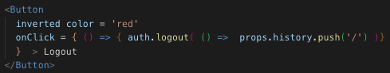

## Experiments with Protected Routes
An authenticated login is simulated to render a protected route from a landing page. Any undefined route is directed to NotFoundPage. A few spinners from 'react spinner' and some UI components from Semantic UI React are sprinkled in for fun. To help communicate routes, each component also describes current path along with page description.
    
 
        
    

### auth.js
 - auth obj defined to simuulate login/authentication
 - lower-case used because we are expecting an instance of auth obj
    - auth.login called with a callback when login successful and will redirect user to the protected route  
    

        
    

    - auth.logout called with a callback to change status of authenticated to false and redirect back to landing page
    

        
    
    

### ProtectedRoute
 -  receives destructured component prop & ...rest
 -  within route, ...rest is restructured
 -  authentication status is verified
 -  render prop used to return either:
#### ProtectedPage component
    

        
    

#### Redirect component from Router
    

        
    

### App
    - uses Switch to make sure only 1 Route is active at a time
    - render props used to provide description of Routed component

#### Configuration details
1) Set up React app `yarn create react-app app`

2) Add router dependencies  `yarn add react-router-dom` and wrap `<App/> in <BrowserRouter>`

3) Add `react-spinner` dependencies
    - `yarn add @emotion/core react-spinner @emotion/styled babel-plugin-emotion`
    - ``
4) Add `semantic UI  React` dependencies and configure `index.html`
    - `yarn add semantic-ui-react`
    - add to `index.html`  
        `<link rel="stylesheet" href="//cdn.jsdelivr.net/npm/semantic-ui@2.4.2/dist/semantic.min.css" />`

